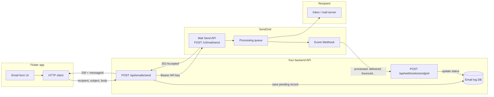
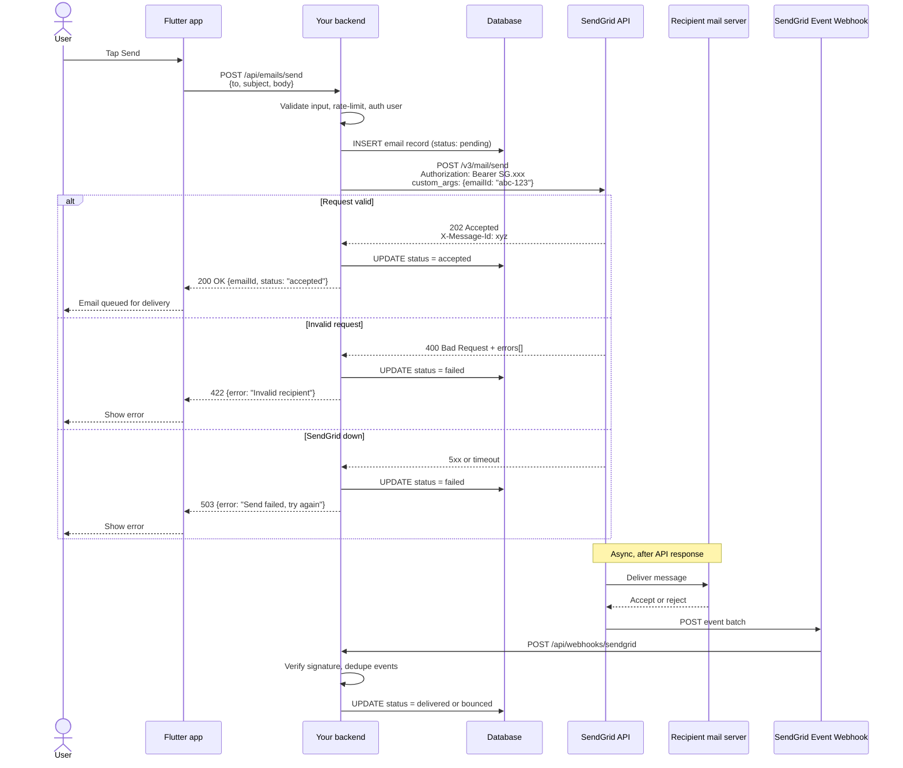
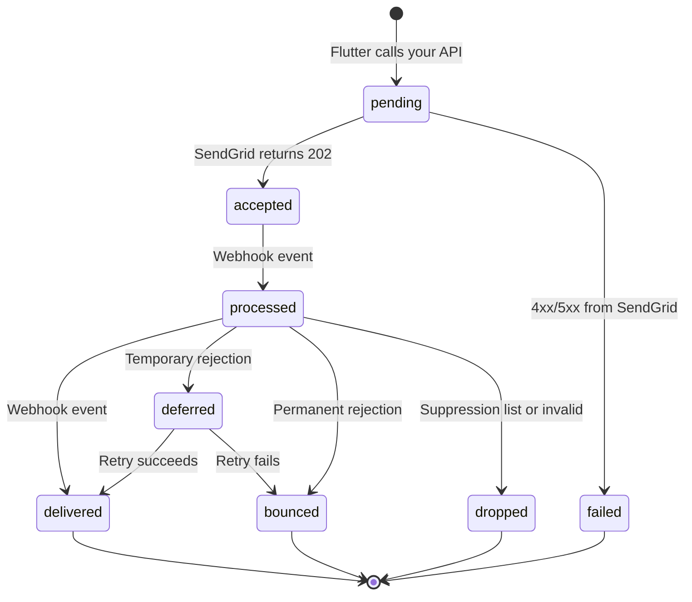
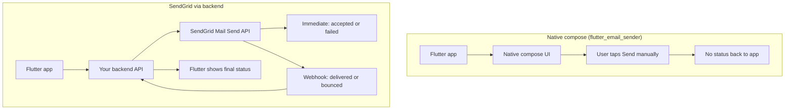

+++
date = '2026-06-05T10:25:23+07:00'
draft = false
title = 'Send email from mobile app: Native email client vs SendGrid'
tags = [
    "twilio",
    "flutter",
    "email",
]
categories = [
    "Backend",
    "Flutter",
    "Mobile",
    "Email",
    "Webhooks",
    "API Integration",
    "Twilio",
    "Mobile Backend",
    "Flutter Email Sender",
]
+++

If you've tried sending email from a Flutter app with `flutter_email_sender` or `url_launcher`, you've hit the same wall: the app can open a compose screen, but it can't tell you whether the email was sent, cancelled, or bounced.

SendGrid fixes that. Your backend sends the email through SendGrid's Mail Send API, returns an immediate accept/reject result to Flutter, and optionally tracks final delivery through Event Webhooks.

This article covers the full flow, the architecture you need, and what each layer is responsible for.

## The problem with native compose UIs

Packages like `flutter_email_sender` and `url_launcher` delegate sending to the user's mail app. Your Flutter code only learns one thing: whether the compose UI opened.

| Signal                     | `flutter_email_sender` | SendGrid (via backend) |
| -------------------------- | ---------------------- | ---------------------- |
| Compose UI opened          | Yes                    | N/A (no compose UI)    |
| User tapped Send           | No                     | N/A                    |
| API accepted the message   | No                     | Yes (HTTP 202)         |
| Message delivered to inbox | No                     | Yes (webhook event)    |
| Bounce / invalid address   | No                     | Yes (webhook event)    |

On iOS, `MFMailComposeViewController` reports `MFMailComposeResult` (sent, saved, cancelled, failed) to native code, but `flutter_email_sender` does not surface that to Dart. On Android, email intents don't return reliable send status at all.

For transactional email (receipts, password resets, OTP codes, support tickets), you need a server-side sender.

## The one rule: never put your API key in Flutter

SendGrid API keys are secrets. If you embed one in a mobile app, anyone can extract it from the binary and send email on your account.

The correct layout:

```
Flutter app  →  your backend API  →  SendGrid Mail Send API  →  recipient inbox
                      ↑
              SendGrid Event Webhook (delivery status)
```

Flutter talks to **your** API. Your API talks to SendGrid.

## High-level architecture



### What each layer does

**Flutter app**
- Collects recipient, subject, body (attachments go to your API as multipart uploads).
- Calls your backend endpoint, not SendGrid directly.
- Shows immediate feedback: accepted or failed.
- Optionally polls or subscribes for final delivery status.

**Your backend**
- Stores the SendGrid API key and verified sender address.
- Validates and rate-limits requests.
- Calls `POST https://api.sendgrid.com/v3/mail/send`.
- Persists an email record with a correlation ID.
- Hosts a webhook endpoint for SendGrid delivery events.

**SendGrid**
- Validates the JSON payload.
- Returns **202 Accepted** when the message is queued (not when it lands in the inbox).
- Delivers to the recipient's mail server.
- Pushes batched events to your webhook URL.

## End-to-end send flow



Two phases matter:

1. **Synchronous (seconds):** your API knows if SendGrid accepted the message.
2. **Asynchronous (seconds to minutes):** webhooks tell you if the recipient's mail server accepted it.

`202 Accepted` means "queued for delivery," not "in the inbox."

## Email lifecycle states

Map SendGrid events to statuses your app can display:



### Event types to track

| Event            | Meaning                                                 |
| ---------------- | ------------------------------------------------------- |
| `processed`      | SendGrid received and queued the message                |
| `delivered`      | Recipient's mail server accepted it                     |
| `deferred`       | Temporary failure; SendGrid will retry                  |
| `bounce`         | Permanent failure (bad address, mailbox full)           |
| `dropped`        | SendGrid blocked send (suppression list, invalid email) |
| `open` / `click` | Engagement tracking (optional)                          |

Reference: [SendGrid Event Webhook docs](https://docs.sendgrid.com/api-reference/webhooks).

## Backend: Mail Send API

### Request payload

```json
{
  "personalizations": [{
    "to": [{ "email": "user@example.com" }],
    "custom_args": { "email_id": "abc-123" }
  }],
  "from": { "email": "noreply@yourdomain.com", "name": "Your App" },
  "subject": "Hello from Flutter",
  "content": [{ "type": "text/plain", "value": "Email body here" }]
}
```

`custom_args` ties webhook events back to the database record you created when the user tapped Send.

### Example: Node.js endpoint

```javascript
import express from "express";
import sgMail from "@sendgrid/mail";

const app = express();
app.use(express.json());

sgMail.setApiKey(process.env.SENDGRID_API_KEY);

app.post("/api/emails/send", async (req, res) => {
  const { to, subject, body } = req.body;
  const emailId = crypto.randomUUID();

  // Save to DB first: { emailId, status: "pending", ... }

  try {
    const [response] = await sgMail.send({
      to,
      from: { email: "noreply@yourdomain.com", name: "Your App" },
      subject,
      text: body,
      customArgs: { email_id: emailId },
    });

    // Update DB: status = "accepted"
    res.json({
      emailId,
      status: "accepted",
      messageId: response.headers["x-message-id"],
    });
  } catch (err) {
    // Update DB: status = "failed"
    res.status(422).json({ error: err.response?.body?.errors ?? err.message });
  }
});
```

Reference: [Mail Send API](https://docs.sendgrid.com/api-reference/mail-send).

## Flutter: call your backend, not SendGrid

Replace `FlutterEmailSender.send()` with an HTTP call:

```dart
import 'dart:convert';
import 'package:http/http.dart' as http;

Future<SendEmailResult> sendEmail({
  required String to,
  required String subject,
  required String body,
}) async {
  final response = await http.post(
    Uri.parse('https://api.yourapp.com/api/emails/send'),
    headers: {'Content-Type': 'application/json'},
    body: jsonEncode({'to': to, 'subject': subject, 'body': body}),
  );

  final data = jsonDecode(response.body) as Map<String, dynamic>;

  if (response.statusCode == 200) {
    return SendEmailResult.accepted(
      emailId: data['emailId'] as String,
    );
  }

  return SendEmailResult.failed(
    message: data['error'] as String? ?? 'Send failed',
  );
}
```

Your UI can now show meaningful states:

- **Accepted:** "Email queued for delivery"
- **Failed:** show the API error message
- **Delivered / bounced:** fetch from your backend or push via WebSocket

## Webhook handler

Configure the Event Webhook URL in the [SendGrid dashboard](https://app.sendgrid.com/). SendGrid POSTs batched JSON arrays to your endpoint every ~30 seconds or when the batch reaches 768 KB.

```javascript
app.post("/api/webhooks/sendgrid", express.raw({ type: "application/json" }), (req, res) => {
  // 1. Verify ECDSA signature (required in production)
  // 2. Parse event array
  const events = JSON.parse(req.body);

  for (const event of events) {
    const emailId = event.email_id; // from custom_args
    const status = event.event;     // processed, delivered, bounce, etc.

    // 3. Deduplicate (SendGrid may send duplicates)
    // 4. Update DB record for emailId
  }

  res.sendStatus(200); // acknowledge within 10 seconds
});
```

Reference: [Event Webhook security](https://docs.sendgrid.com/for-developers/tracking-events/getting-started-event-webhook-security-features).

## Setup checklist

1. Create a [SendGrid account](https://sendgrid.com/) and verify your sender domain (SPF/DKIM).
2. Create a restricted API key with Mail Send permission only.
3. Build `POST /api/emails/send` on your backend.
4. Build `POST /api/webhooks/sendgrid` with signature verification.
5. Add a database table: `email_id`, `status`, `sendgrid_message_id`, `created_at`, `updated_at`.
6. Update your Flutter screen to call your backend instead of opening the native composer.

## Native compose vs SendGrid



## When to use which approach

**Use native compose (`flutter_email_sender` / `url_launcher`) when:**
- You want a "Contact support" button that opens the user's mail app.
- The user should review and send the email themselves.
- You don't need delivery tracking.

**Use SendGrid (via backend) when:**
- You send transactional email automatically (receipts, resets, notifications).
- You need to know if the send succeeded or failed.
- You want HTML templates, attachments, or bulk sending without user action.

## Trade-offs

**Pros**
- Real send success/failure (immediate + delivery events)
- HTML templates, attachments, bulk send
- No dependency on the user having a mail app configured

**Cons**
- Requires a backend (Flutter can't hold the API key safely)
- `202 Accepted` is not the same as delivered; you need webhooks for final status
- Domain verification and deliverability setup (SPF, DKIM, IP warmup)
- Cost scales with volume (free tier: 100 emails/day, then paid plans)

## How this compares to an event-driven gateway

In larger systems, email often flows through an internal message bus before reaching an ESP. A typical pattern:

```
Client backend → output-manager → Kafka topics → email gateway → ESP API → inbox
```

That adds async buffering, multi-provider routing (Infobip, Macrokiosk, SendGrid), and template formatting at scale. For a Flutter app starting out, the direct path (Flutter → your API → SendGrid) is enough. You can introduce Kafka and gateway services when volume, templating, or multi-provider failover demand it.

## Further reading

- [SendGrid Mail Send API](https://docs.sendgrid.com/api-reference/mail-send)
- [SendGrid Event Webhooks](https://docs.sendgrid.com/api-reference/webhooks)
- [Web API vs SMTP for sending email](https://docs.sendgrid.com/for-developers/sending-email/web-api-vs-smtp)
- [flutter_email_sender on pub.dev](https://pub.dev/packages/flutter_email_sender)
