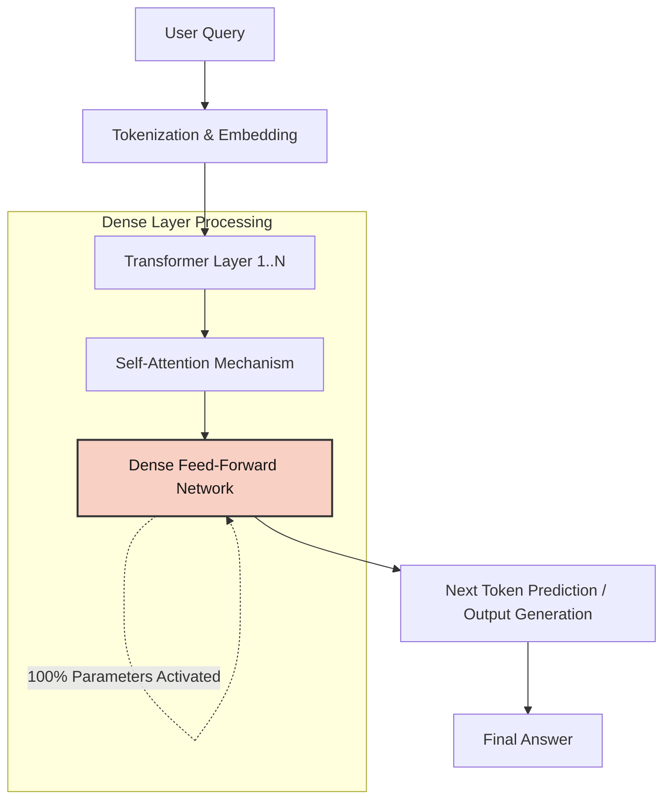
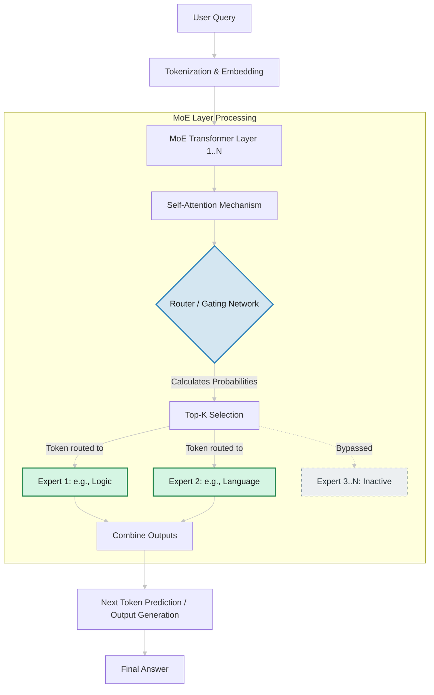

+++
date = '2026-03-30T00:39:26+07:00'
draft = false
title = 'Evolution of LLM Architecture Transformers Dense Models and MoE'
tags = ["llm", "transformers", "moe", "machine-learning", "architecture"]
categories = ["Machine Learning"]
+++

## From transformers to mixture of experts

You get a short map of how large language model stacks evolved: what changed when transformers replaced sequential models, how encoder-only and decoder-only designs differ, and why mixture-of-experts (MoE) routing matters for cost and throughput at trillion-parameter scale. Two Mermaid diagrams show how a query flows through a dense stack versus an MoE stack.

---

### 1. Transformers and attention

The **Transformer architecture** replaced token-by-token recurrence with **self-attention**, so the model can relate all positions in a sequence in parallel and train efficiently on accelerators.

* **Encoder-only (e.g., BERT):** Reads the input in both directions. Strong for understanding, classification, retrieval, and extraction.
* **Decoder-only (e.g., GPT):** Trains left-to-right to predict the next token. That pattern powers most chat and completion APIs you use today.

---

### 2. Dense models vs. mixture of experts

* **Classic dense models:** On each forward pass, every token goes through the same large feed-forward block; essentially the full parameter set participates in that step. That gives straightforward behavior at the cost of compute per token.
* **MoE:** The network is split into **experts**. A **router (gating network)** scores each token and sends it to the top one or two experts. Total parameter count can reach trillions while only a small fraction of weights are active per token (often cited on the order of a few percent), which improves throughput and energy per useful flop for the same hardware budget.

---

### 3. Data flow: classic dense model

Every token uses the same feed-forward path; all parameters in that block contribute to the computation for that token.

---

### 4. Data flow: mixture of experts

Attention stays shared; routing picks which expert MLPs run for each token. Inactive experts do no work for that token.

---

### 5. What this leaves out

Tokenization and embedding turn text into tensors the stack can consume; that step is its own topic (vocab, byte-pair encoding, positional info, and so on).
