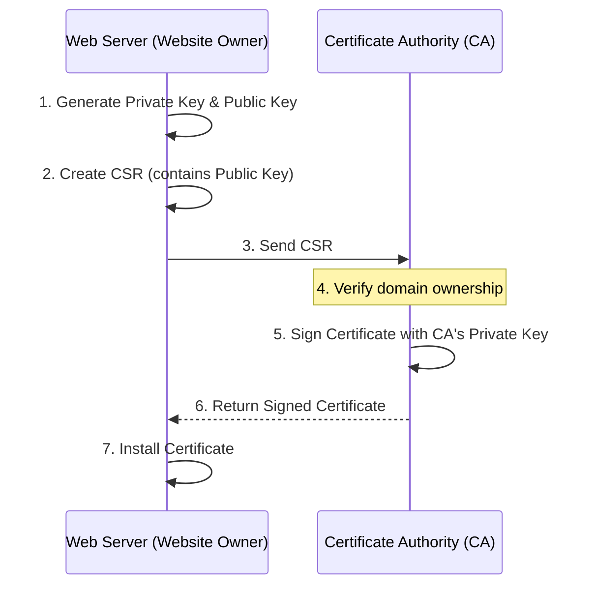
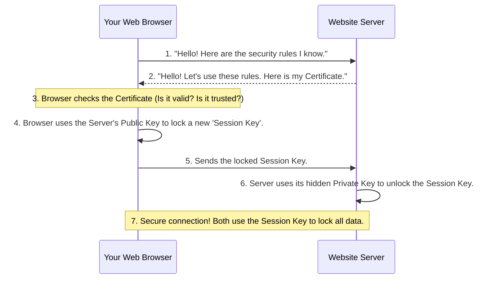

+++
date = '2026-03-14T15:35:31+07:00'
draft = false
title = 'How Digital Certificates Work: From Websites to Windows Apps'
+++
 
## The Complete Guide to Digital Certificates: How They Keep the Internet Safe

When you visit a secure website or install a new app, your computer uses digital certificates to keep you safe. Think of a digital certificate like a digital ID card or a passport. It proves that a website or an app is exactly who they claim to be.

Let's explore why we need them, how they are made, how they work behind the scenes, and how web certificates compare to app certificates.

---

### 1. The Internet Before Certificates: A Dangerous Place

Before digital certificates became the standard, almost the entire internet used plain HTTP.  This early version of the internet had massive security weaknesses:

* **Eavesdropping (Man-in-the-Middle):** Data was sent in "plain text." If you typed a password into a website, it traveled across the internet like an open postcard. Anyone on the same public Wi-Fi could easily read it.
* **Spoofing (Impersonation):** Because there were no digital IDs, you could never be sure who you were talking to. A hacker could easily create a fake bank website and trick you into giving them your information.

---

### 2. How a Website Gets its Digital ID

To fix these problems, websites now use HTTPS, which requires an SSL/TLS certificate. A website owner gets this from a trusted company called a **Certificate Authority (CA)**.

Here is the step-by-step process of how a certificate is born:



1. **Create the Keys:** The web server creates two linked keys: a **Private Key** (kept secret) and a Public Key (shared with everyone).
2. **Create the Request (CSR):** The server makes a Certificate Signing Request (CSR) file. It holds the Public Key and website details.
3. **Send to the CA:** The owner sends this CSR to the Certificate Authority.
4. **Verification & Signing:** The CA checks if the person really owns the website. If true, the CA uses its own highly trusted key to "sign" the certificate and sends it back.

---

### 3. The Secret Handshake: How HTTPS Works

When you type a secure address into your browser, your computer and the website's server perform a very fast, secret conversation called the **TLS Handshake**.

Here is how your browser uses the certificate to create a secure tunnel:



---

### 4. Web Certificates vs. `.msix` App Certificates

Digital certificates are also used when you install software, like a Windows `.msix` app. Both use the exact same underlying math (the X.509 standard), but their jobs are different:

| Feature | HTTPS Web Certificate | Code Signing Certificate (.msix) |
| --- | --- | --- |
| **Main Goal** | Secures data moving between you and a website. | Proves who made the app and ensures the app file has not been hacked. |
| **Trust Rule** | Marked for "Server Authentication". | Marked for "Code Signing". |
| **Lifespan** | Usually lasts for 1 year or less. | Can last longer. The app remains valid even after the cert expires, if signed with a "Timestamp". |

Think of a web certificate like a driver's license (allows you to travel the internet safely), and a code signing certificate like a professional seal (guarantees the product is authentic).

---

### 5. Do-It-Yourself: Self-Signed Certificates

Sometimes, developers need a certificate just for testing on their own computer. In this case, you can create a **self-signed certificate**. Instead of a CA, your own computer signs the certificate. Because your computer is not a famous CA, browsers will show a red warning, but it is perfect for local testing.

You can create one using a free tool called **OpenSSL** with this command:

```bash
openssl req -x509 -newkey rsa:4096 -keyout private-key.pem -out my-cert.pem -days 365 -nodes

```

This single command creates a strong new key pair, saves your secret Private Key, and generates a self-signed Public Certificate valid for one year.

---

### 6. Are We Perfectly Safe Now?

Certificates fixed many problems, but hackers still find ways around them:

* **Phishing with Valid Certificates:** Hackers can buy a real certificate for a fake name (like `www.paypa1.com` instead of `paypal`). You get a secure connection, but you are securely talking to a hacker.
* **Stolen Private Keys:** If a hacker steals a company's Private Key, they can perfectly impersonate that company.
* **Compromised CAs:** If a Certificate Authority gets hacked, attackers can issue fake certificates for *any* website. This is rare but extremely dangerous.

---

### Vocabulary

* **Certificate Authority (CA):** A trusted company that checks identities and issues digital certificates.
* **CSR (Certificate Signing Request):** An application form sent to a CA to ask for a certificate.
* **HTTPS:** A secure way to send data over the internet.
* **Man-in-the-Middle (MitM) Attack:** A cyber attack where a hacker secretly listens to the communication between two people.
* **OpenSSL:** A free software tool used by developers to manage digital keys.
* **Phishing:** A scam where hackers create fake websites to trick people into giving away passwords.
* **Plain Text:** Information that is not encrypted or locked. It can be read by anyone.
* **Private Key:** A secret digital code used to secure data. It must never be shared.
* **TLS Handshake:** The quick, automated conversation between a browser and a server to start a secure connection.
* **X.509:** The standard format or "blueprint" used to build digital certificates worldwide.

