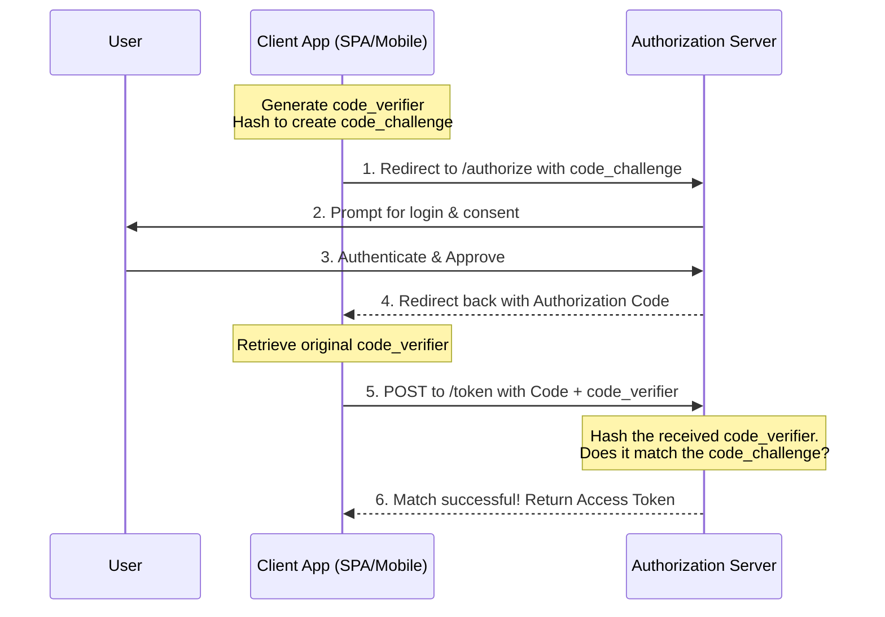

+++
date = '2026-03-08T23:12:22+07:00'
draft = false
title = 'TIL: Why OAuth 2.0 Needs PKCE (and How It Replaces the Client Secret)'
tags = ["oauth2", "pkce", "security"]
categories = ["Security"]
+++

Today I learned how **PKCE** (Proof Key for Code Exchange, pronounced *"pixie"*) solves a major security flaw in the standard OAuth 2.0 Authorization Code flow for public applications.

## The Problem: Secrets Aren't Always Secret

In a traditional web application, you use a `client_secret` to authenticate your app with an Authorization Server (like Google or Auth0) when exchanging an Authorization Code for an Access Token. Because the backend server is secure, the secret stays safe.

However, for **Public Clients** like Single Page Apps (React/Vue) or Mobile Apps (iOS/Android), storing a `client_secret` is dangerous. Anyone can inspect the browser's network tab or decompile the mobile app to steal the secret and impersonate the application.

## The Solution: Enter PKCE

Instead of relying on a static, hardcoded password (`client_secret`), PKCE introduces a **dynamic, one-time secret** created on the fly for every single login attempt.

It relies on two main components:

* **Code Verifier:** A cryptographically random string generated by the client app (the "one-time secret").
* **Code Challenge:** A Base64-URL encoded SHA-256 hash of the Code Verifier.

Because hashing is a one-way street, the client can safely send the `code_challenge` over the network without revealing the original `code_verifier`.

## How the PKCE Flow Works

1. **The Setup:** The app generates a `code_verifier` and hashes it to create the `code_challenge`.
2. **The Request:** The app redirects the user to the Auth Server, passing along the `code_challenge`. The server saves this challenge.
3. **The Consent:** The user logs in and grants permission. The Auth Server redirects back to the app with a temporary **Authorization Code**.
4. **The Exchange:** To get the Access Token, the app sends the Authorization Code **AND** the original `code_verifier` to the Auth Server.
5. **The Verification:** The Auth Server hashes the received `code_verifier` and compares it to the `code_challenge` it saved in step 2. If they match, the server knows it's the exact same app that initiated the request, and grants the Access Token!

## Sequence Diagram

Here is the visual representation of the communication between the App, the User, and the Auth Server:

## Key Takeaway

Even if a malicious actor intercepts the Authorization Code during the redirect (an Interception Attack), the code is useless to them. They cannot exchange it for an Access Token because they do not have the original `code_verifier` to prove they are the legitimate app.

*Always use PKCE, even for backend web apps, as it is the current industry standard recommended by OAuth 2.1!*
