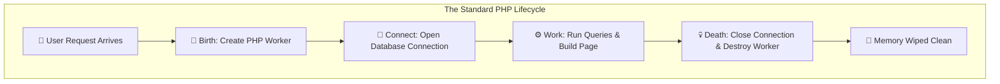

+++
date = '2026-03-16T13:54:51+07:00'
draft = false
title = 'TIL: Why Standard PHP Does Not Share Database Connections (And How to Fix It)'
tags = ["php", "database", "mysql"]
categories = ["Backend"]
+++

If you are coming to PHP from languages like Java, C#, or Node.js, you might expect your application to keep a "pool" of database connections open in the background. This allows different users to share active connections, making the app faster and saving resources.

However, standard PHP does not work this way. Let's look at why PHP handles databases differently and how modern developers solve this problem.

---

## 1. The "Shared-Nothing" Architecture

In standard setups, PHP works on a "shared-nothing" rule. Think of it as a worker who is hired for exactly one job and is immediately fired when the job is done.

The lifecycle looks like this:

* **Birth:** A user visits your website. A PHP worker is created from scratch to handle this exact request.
* **Work:** The worker connects to the database, asks for information, and builds the webpage.
* **Death:** As soon as the webpage is sent to the user, the PHP worker is destroyed. All of its memory is wiped clean, and its database connection is closed.

Because everything is wiped away at the end of every request, there is nowhere to safely store a "pool" of connections for the next user.

## 2. No Central Manager

To have a true connection pool, you need a "manager"—a program that stays alive forever to hand out connections to workers and take them back when they are done. Standard PHP does not have this. Every PHP worker is completely alone and isolated in its own room. Worker A cannot share its database connection with Worker B.

## 3. What About Persistent Connections?

You might have heard of "persistent connections" in PHP. While these sound like a pool, they are actually quite different.

When you use a persistent connection, PHP tells the worker to leave the connection open after the worker dies. If that *exact same* worker is born again for a new request, it can reuse the connection.

The problem? If your server has 100 workers, you will end up with 100 open database connections, even if 99 of them are doing nothing. It does not actively share or limit connections like a true pool.

---

## 4. How We Solve This Today

Since PHP cannot pool connections on its own, developers use clever workarounds:

* **Database Proxies (The Middleman):** Instead of PHP talking straight to the database, PHP talks to a lightweight proxy program running on the server. The proxy stays alive forever and manages a pool of connections to the real database.
* *For MySQL:* Developers use **ProxySQL**.
* *For PostgreSQL:* Developers use **PgBouncer**.

* **Long-Running PHP:** New tools let PHP stay alive in memory forever, just like Node.js. Because the script never dies, true connection pooling becomes possible. Popular tools for this include **Swoole**, **RoadRunner**, and **Laravel Octane**.

---

### Vocabulary

* **Architecture:** The basic design, structure, or rules of a computer system.
* **Counterintuitive:** Something that is the opposite of what you would naturally expect.
* **Allocate:** To give or assign something (like computer memory) for a specific job.
* **Terminate:** To end, stop, or destroy.
* **Proxy:** A "middleman" program that sits between two systems and passes messages between them.
* **Persistent:** Something that continues to live or exist for a long time.

