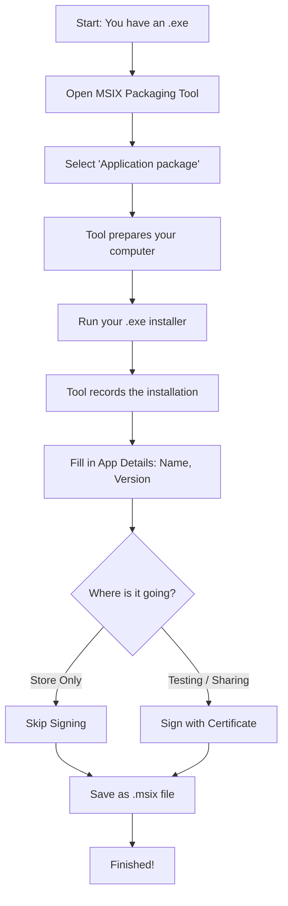

+++
date = '2026-03-14T16:05:21+07:00'
draft = false
title = 'Package Your Own Msix and Ship'
+++

If you have built a Windows program (an `.exe` file) and want to wrap it into a modern Windows format (an `.msix` file), you are in the right place. The `.msix` format makes installing, updating, and removing apps very clean and safe for Windows computers.

You asked a great question: **Can you create a single `.msix` file for local testing, sharing with a closed group, and publishing to the Microsoft Store?**

**The short answer is:** Yes, you can use the exact same package for all three. However, the "ID card" (called a certificate) you attach to the package changes how easy it is for people to install.

Here is how it works for your three goals:

1. **Microsoft Store:** The Store is easy. You upload your `.msix` file to Microsoft. They check it and attach their own trusted ID card to it. Anyone can download it safely.
2. **Local Testing:** Windows will only install an `.msix` if it has an ID card it trusts. For your own machine, you can create a free, "self-made" ID card and tell your computer to trust it.
3. **Closed Party:** If you send that same file with the "self-made" ID card to friends, their computers will block it. To fix this, they must manually tell their computers to trust your self-made ID card before installing.

*Tip: If you want one file that installs easily for everyone without the Store, you have to buy an official ID card (a Public Certificate) from a trusted company. Then, one file works perfectly everywhere!*

---

## The Packaging Process

To change your `.exe` into an `.msix`, you will use a free app from Microsoft called the **MSIX Packaging Tool**. It works like a video camera: it records what your `.exe` does when it installs, and wraps those actions into a neat `.msix` box.

### Flow Diagram: Step-by-Step

Here is the logic of how the process flows:

---

## Step-by-Step Guide

Follow these steps to build your package:

1. **Get the Tool:** Download the **MSIX Packaging Tool** from the Microsoft Store.
2. **Prepare:** Open the tool and select "Application package". The tool will check your computer to make sure it is ready to record.
3. **Record the Install:** The tool will ask for your `.exe` file. It will run your installer. Click through your setup process just like you normally would.
4. **Capture:** Once your program is installed, tell the tool you are done. The tool gathers all the files your `.exe` just created.
5. **Add Details:** Type in the name of your app, the version number, and your publisher name.
6. **Sign the Package (Important!):** * If this is *only* for the Microsoft Store, you can skip this step.
* If you want to test it locally or share it, you must choose a certificate here to sign it. You can create a free one right inside the tool for testing.

7. **Save:** Choose where to save your file. You now have an `.msix` package!

---

### Vocabulary

* **.exe (Executable):** A traditional Windows program file that runs or installs software.
* **.msix:** A modern Windows package format. It keeps Windows clean by packing all app files together so they do not scatter across the computer.
* **Certificate:** A digital "ID card" attached to software. It proves who made the software and guarantees the file has not been changed by a hacker.
* **Self-Signed Certificate:** A free ID card you make yourself. Your computer can be told to trust it, but other people's computers will not trust it automatically.
* **Public Certificate (CA):** An official ID card you buy from a trusted security company. All Windows computers trust these automatically.

